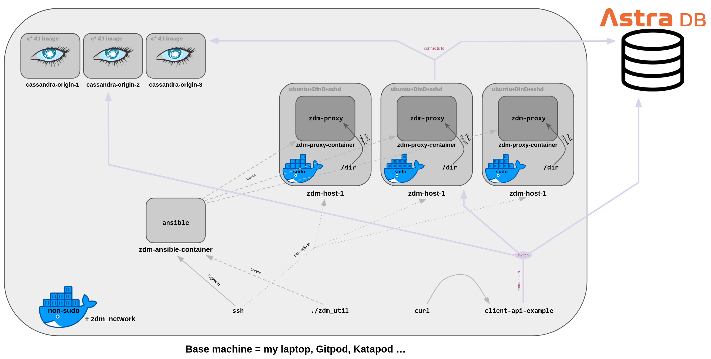

# ZDM Scenario

The following is a fully Dockerized ZDM scenario,
designed to later run as interactive batteries-included scenario.

In its current status, there are

- "behind-the-scenes" instructions (initial setup and a few steps along the way), later meant to be hidden away from the user;
- actual steps meant to be exposed for the user/learner.

> The former will be marked like this and the associated code blocks are commented with `#HIDDEN`.

The latter will be in simple text with ordinary code blocks.

**Table of Contents**

- [Outline](#outline)
- [HIDDEN Initial setup](#hidden-initial-setup)
- [Preliminary steps](#preliminary-steps)
- [Phase 1: Connect clients to ZDM Proxy](#phase-1-connect-clients-to-zdm-proxy)
- [Phase 2: Migrate and validate data](#phase-2-migrate-and-validate-data)
- [Phase 3: Enable asynchronous dual reads](#phase-3-enable-asynchronous-dual-reads)
- [Phase 4: Change read routing to Target](#phase-4-change-read-routing-to-target)
- [Phase 5: Connect your client applications directly to Target](#phase-5-connect-your-client-applications-directly-to-target)
- [Epilogue: cleanup](#epilogue-cleanup)

### Outline

Here we try to reproduce the full migration process, start-to-end, so that the scenario learner
will experience it "as in real life". But we want to package everything as Docker containers, so as to
be able to run the whole thing within a Gitpod (and later Katapod) environment.
This, under the tenet "the user shall not notice the difference with the real thing",
entails a few challenges, such as:

- the need for Docker images behaving as close as possible to actual Ubuntu boxes;
- the need for most containers to speak to each other (including containers created by the automation);
- the need for a sufficiently isolated docker-in-docker (mimicking what in real life would be docker in a separate physical machine).



The "base machine" (the only physical machine in the scenario) runs Docker for use by non-superuser.
At this layer a sample API runs, connected alternatively to Origin/Target/Proxy and probed by simple `curl`.
Prior to the user intervention, 6 containers are created and started: a 3-node Cassandra cluster (Origin)
and three Ubuntu boxes, which will act as the proxy hosts: these run modified DinD images, providing
a docker-in-docker (as well as ssh access and all that is needed).
Running `zdm-util` on the base machine creates the `zdm-ansible-container` container, in which
the Ansible playbook will run to create the proxy containers in the three "Ubuntu" boxes.
_Note_: the monitoring stack is left out of this picture for clarity.

## (HIDDEN) Initial setup

### (HIDDEN) Initial setup, network+origin

> Create password-enabled Cassandra for Origin:

```
# HIDDEN
cd image_origin
docker build . -t cassandra-auth:4.1
cd ..
```

> Create network and start first node in it

```
# HIDDEN
docker network create zdm_network
docker run --name cassandra-origin-1 --network zdm_network -d cassandra-auth:4.1
```

> Wait 60-90 seconds, until this command works: `docker exec -it cassandra-origin-1 nodetool status`.
> Then:

```
# HIDDEN
docker run --name cassandra-origin-2 -d --network zdm_network -e CASSANDRA_SEEDS=cassandra-origin-1 cassandra-auth:4.1
```

> When the `nodetool` above gives two `UN`s, proceed:

```
docker run --name cassandra-origin-3 -d --network zdm_network -e CASSANDRA_SEEDS=cassandra-origin-1 cassandra-auth:4.1
```

> All good when the `nodetool` gives a triple `UN`.

**TODO** make this cluster creation as short as possible. Now it takes several minutes (which would be spent by the user reading an intro page or something)

### (HIDDEN) Initial setup, dependencies for client application

```
# HIDDEN
pip install -r client_application/requirements.txt
```

> _Note_: in local machine, please do use a virtualenv for this.

### (HIDDEN) Initial setup, data in Origin

> Copy the init scripts to origin node 1 and execute:

```
docker cp origin_prepare/origin_schema.cql cassandra-origin-1:/
docker cp origin_prepare/origin_populate.cql cassandra-origin-1:/
docker exec -it cassandra-origin-1 cqlsh -u cassandra -p cassandra -f /origin_schema.cql
docker exec -it cassandra-origin-1 cqlsh -u cassandra -p cassandra -f /origin_populate.cql
```

> Check with

```
docker exec -it cassandra-origin-1 cqlsh -u cassandra -p cassandra -e "select * from my_application_ks.user_status where user='eva';"
```

### (HIDDEN) Initial setup, build Dind+Ubuntu+ssh image

*TODO* License check for adaptation and re-use of: https://github.com/cruizba/ubuntu-dind

> Build the DinD + ssh + ubuntu user image with:

```
# HIDDEN
cd image_ubuntu-dind-ssh
docker build . -t dind-ssh-ubuntu:18
```

### (HIDDEN) Initial setup, create the ZDM host containers

```
# HIDDEN
docker run --name zdm-host-1 -d -i --privileged --network zdm_network dind-ssh-ubuntu:18
docker run --name zdm-host-2 -d -i --privileged --network zdm_network dind-ssh-ubuntu:18
docker run --name zdm-host-3 -d -i --privileged --network zdm_network dind-ssh-ubuntu:18
```

> Make sure ssh server is running and get the addresses. These IPs are needed later by the user as well.

```
# HIDDEN
docker exec zdm-host-1 service ssh restart
docker exec zdm-host-2 service ssh restart
docker exec zdm-host-3 service ssh restart
#
ZDM_HOST_1_IP=`docker inspect zdm-host-1 | jq -r '.[].NetworkSettings.Networks.zdm_network.IPAddress'`
ZDM_HOST_2_IP=`docker inspect zdm-host-2 | jq -r '.[].NetworkSettings.Networks.zdm_network.IPAddress'`
ZDM_HOST_3_IP=`docker inspect zdm-host-3 | jq -r '.[].NetworkSettings.Networks.zdm_network.IPAddress'`
echo "ZDM Host IPs: ${DI_ZDM_HOST_1_IP} , ${DI_ZDM_HOST_2_IP} , ${DI_ZDM_HOST_3_IP}"
```

**TODO** a user-exposed "collect-addresses" script which neatly prints required infra info (mainly IPs).

### (HIDDEN) Initial setup, create Ubuntu box for monitoring

**TODO**: deal with the monitoring machine (an image with `systemd` is needed, no need for DinD there).

## Preliminary steps

**TODO** here describe the infrastructure to user and provide them with the
IP-addresses script and have them run it.

### Get your Astra DB ready

- Create Astra DB (with `my_application_ks` keyspace);
- Retrieve Secure Connect Bundle;
- Retrieve a token with "R/W User" role;
- Find the "Database ID" for your Astra DB instance;
- Create Schema within keyspace (see below).

**TODO**. **Warning**: with the "R/W User" token, you cannot create the schema in any other
way than on the CQL Web Console. For the time being, we stick to it, so:
Go to CQL Console and copy-paste the contents of `target/prepare/target_schema.cql`

### Have a client application running

On the base machine, run an API which connects to the DB (for now, Origin, but easy
to switch). The API will be able to read and write, reachable with simple `curl` commands.

Get the IP of the origin-1 machine,

```
CASSANDRA_CONTACT_POINT=`docker inspect cassandra-origin-1 | jq -r '.[].NetworkSettings.Networks.zdm_network.IPAddress'`
echo ${CASSANDRA_CONTACT_POINT}
cd client_application
```

Prepare `.env` by copying `cp .env.sample .env` and editing it:
`CASSANDRA_SEED`, `ASTRA_DB_SECURE_BUNDLE_PATH`, `ASTRA_DB_CLIENT_ID`, `ASTRA_DB_CLIENT_SECRET`.
You can also set the `ZDM_PROXY_SEED`, which will be used later, with the IP address of the first
proxy host machine (`echo ${ZDM_HOST_1_IP}`).

To run the API with connection to Origin, start as:

```
CLIENT_CONNECTION_MODE=CASSANDRA uvicorn api:app
```

This console will keep running the API. Experiment in another console with `curl`
and optionally read the table itself as a further check:

```
curl -s localhost:8000/status/eva | jq
curl -s -XPOST localhost:8000/status/eva/New | jq
curl -s -XPOST localhost:8000/status/eva/ItIs_`date +'%H-%M-%S'` | jq
```

**TODO** Make these curl into a bash loop-with-sleep?

**TODO** Different keyspace names, possible? We sure don't do that here, we could have a global keyspace name in `.env` for that matter.

**TODO** Confirm that to connect to ZDM a single seed is OK and the rest is discovered?

## Phase 1: Connect clients to ZDM Proxy

### Set up the ZDM Automation

> The base machine will be the jumphost, in whose Docker the automation creates
> the `zdm-ansible-container`. When this container runs, it will reach the
> three `zdm-host-[1,2,3]` containers, treating them as machines, and will deploy
> the ZDM host in their own (DinD-based) Dockers.

Time to download and run `zdm-util`, which creates the Ansible container which
will then deploy the ZDM proxies. On the base machine:

```
cd running_zdm_util
wget https://github.com/datastax/zdm-proxy-automation/releases/download/v2.0.0/zdm-util-linux-amd64-v2.0.0.tgz
tar -xvf zdm-util-linux-amd64-v2.0.0.tgz
rm zdm-util-linux-amd64-v2.0.0.tgz 
```

You will have to provide the following answers:

- the private key location: `../zdm_host_private_key/zdm_deploy_key`;
- the common prefix for the three ZDM hosts: **TODO** a script that outputs them to the user (no need for them to docker inspect, this would be behind-the-scenes);
- no, you don't have an inventory file yet;
- no, this is not for testing;
- enter the three ZDM host IPs (see **TODO** above);
- **TODO** the monitoring machine when it's there.

Now run:

```
./zdm-util-v2.0.0
```

A `zdm-ansible-container` container is created and started for you (on the base machine's Docker).

> **TODO** currently we need to manually attach the ansible container to the network with all other containers. This means that at this point we need to automate the following (or perhaps the whole thing might work in the default Docker network? this is to test):

```
# HIDDEN
docker network connect zdm_network zdm-ansible-container 
```

> We also need to comment out, behind-the-scenes, two tasks in the Ansible install playbook,
> which would install Docker, thereby replacing the modified DinD docker. This should happen
> before the user launches the Ansible playbook. Namely, the tasks to comment from the Ansible
> container's `/home/ubuntu/zdm-proxy-automation/ansible/deploy_zdm_proxy.yml` are:
> (1) `- name: Update apt and install docker-ce` and (2) `- name: Uninstall incompatible Docker-py Module`.

### Configure, deploy and start ZDM proxy

Go to a shell on the `adm-ansible-container` with:

```
docker exec -it zdm-ansible-container bash
```

Once in the container, edit the proxy core configuration with:

```
cd zdm-proxy-automation/
nano ansible/vars/zdm_proxy_core_config.yml   # or use 'vi' if you prefer
```

Edit and uncomment the following entries:

- `origin_username` and `origin_password`: set both to "cassandra" (no quotes);
- `origin_contact_points`: set it to the IP of `cassandra-origin-1`. **TODO** that would be the output of `docker inspect cassandra-origin-1 | jq -r '.[].NetworkSettings.Networks.zdm_network.IPAddress'`, but we will provide it to the user - no need for them to see behind the scenes;
- `origin_port`: set to 9042;
- `target_username` and `target_password`: set to Client ID and Client Secret from your Astra DB "R/W User Token";
- `target_astra_db_id` is your Database ID from the Astra DB dashboard;
- `target_astra_token` is the "token" string in your Astra DB "R/W User Token" (the string starting with `AstraCs:...`).

You can now run the Ansible playbook that will provision and start the proxy containers in the three proxy hosts: still in the Ansible container, launch the command:

```
cd /home/ubuntu/zdm-proxy-automation/ansible
ansible-playbook deploy_zdm_proxy.yml -i zdm_ansible_inventory
```

and watch the show.

### Deploy the monitoring stack

**TODO** as soon as the `systemd` requirement is met in the Ubuntu box containers.

### Connect client applications to proxy

On the base machine, make sure that `client_application/.env` has the
`ZDM_PROXY_SEED` correctly set up with the IP of the first proxy host,
then Ctrl-C the API and restart as:

```
CLIENT_CONNECTION_MODE=ZDM_PROXY uvicorn api:app
```

You can issue some `curl` commands as above to check that both reads and writes
work. Note that you are still reading from Origin, but writing to both.

You can also go to the Astra UI (or cqlsh to it) to check that newly-inserted
rows (and only these for now) are present on Target, that is, Astra DB.

## Phase 2: Migrate and validate data

We will use DSBulk Migrator (in this demo there is a single simple table,
and the one-off migration is not the main focus of this exercise anyway).

On the base machine, clone and build the utility
(the migration will be performed from this machine):

```
cd one_off_migration
git clone https://github.com/datastax/dsbulk-migrator.git
cd dsbulk-migrator/
mvn clean package
```

After this finishes, you can start the migration, providing the necessary
connection and schema information (the "import cluster" will be Origin and
the "export cluster" will be Astra DB):

**TODO** remind user of the info-collecting script here, but have them fill
out the command below themselves, for better understanding:

```
java -jar target/dsbulk-migrator-1.0.0-SNAPSHOT-embedded-dsbulk.jar \
  migrate-live \
  -e \
  --keyspaces=my_application_ks \
  --export-host=IP_OF_CASSANDRA_ORIGIN_1_MACHINE \
  --export-username=cassandra \
  --export-password=cassandra \
  --import-username=ASTRA_DB_TOKEN_CLIENT_ID \
  --import-password=ASTRA_DB_TOKEN_CLIENT_SECRET \
  --import-bundle=/PATH/TO/SECURE-CONNECT-BUNDLE.ZIP
```

Once this command has executed, you will see that now _all_ rows are on Astra
DB as well, including those written prior to setting up the ZDM proxy.
From this point on, the data on Target will not diverge from Origin until
you decide to cut over and neglect Origin altogether.

## Phase 3: Enable asynchronous dual reads

**TODO**: to keep an eye on proxy restarts and everything, it might be desirable to keep
three separate `sudo docker logs -f ...` commands on the three innermost
containers, those running the ZDM proxy. To stick to real life, this
should be achieved instructing the user to ssh and then call `sudo docker logs`.

To enable read mirroring, open a shell in the `zdm-ansible-container` and edit
`zdm_proxy_core_config.yml`:

```
docker exec -it zdm-ansible-container bash
cd zdm-proxy-automation/
nano ansible/vars/zdm_proxy_core_config.yml   # or use 'vi' if you prefer
```

The `primary_cluster` should still be `ORIGIN` at this point. Change the
`read_mode` from `PRIMARY_ONLY` to `DUAL_ASYNC_ON_SECONDARY`.

> **TODO** this playbook does not install (the regular, undesired here) docker-ce,
> but it uninstalls a "python incompatible module", which we would like to remove here as well.
> This means we should comment task `- name: Uninstall incompatible Docker-py Module` from
> the `/home/ubuntu/zdm-proxy-automation/ansible/rolling_update_zdm_proxy.yml` playbook.

While still in the Ansible container, launch a rolling update of the ZDM containers with:

```
cd /home/ubuntu/zdm-proxy-automation/ansible
ansible-playbook rolling_update_zdm_proxy.yml -i zdm_ansible_inventory
```

The logs from the containers will stop one after the other: if you restart the
`sudo docker logs` commands, you will see a very long line being logged that starts
with something like

```
time="2022-10-21T22:43:15Z" level=info msg="Parsed configuration: {\"PrimaryCluster\":\"ORIGIN\",\"ReadMode\":\"DUAL_ASYNC_ON_SECONDARY\" [...]
```

To confirm that everything still works, send some `curl` requests to the
running API (reading and writing) if you want.

## Phase 4: Change read routing to Target

The migration is done and the dual reads confirm everything works and
there are no performance problems: let's start reading from Target already!

Go to the `zdm-ansible-container` again and edit
`zdm_proxy_core_config.yml` once more, this time changing `primary_cluster`
to `TARGET`; then launch another rolling update.

Again, you'll see the logs stopping - restart them if you want and look for
the new setting being logged. Also send some requests to your API as before.

Now, Target is the functioning primary, but origin is still being kept
completely up to date.

## Phase 5: Connect your client applications directly to Target

Until now we can bail out any time. After the following change we are effectively
committing to the migration, with the app directly writing to Astra DB and finally
skipping the ZDM (and Origin) altogether.

Go to the console, on the base machine, where the API is running, Ctrl-C
to stop it and restart it this time with: 

```
CLIENT_CONNECTION_MODE=ASTRA_DB uvicorn api:app
```

The API will still work and the migration is complete. You can destroy
the whole ZDM infrastructure at this point.

## Epilogue: cleanup

You can stop and remove the container running the `zdm-ansible-container`:
on the base machine, launch

```
docker rm -f zdm-ansible-container
```

In a real migration scenario, you would also decommission the machines running
the ZDM hosts and even the Origin Cassandra cluster. In this demo you can skip
these steps (they will be removed anyway when the exercise is over).

> In case cleanup is needed, six machines and one Docker network can be
> destroyed at this point:

```
# HIDDEN
docker rm -f cassandra-origin-1
docker rm -f cassandra-origin-2
docker rm -f cassandra-origin-3
docker rm -f zdm-host-1
docker rm -f zdm-host-2
docker rm -f zdm-host-3
docker network rm zdm_network
```

Congratulations, you completed the ZDM Migration Scenario!
